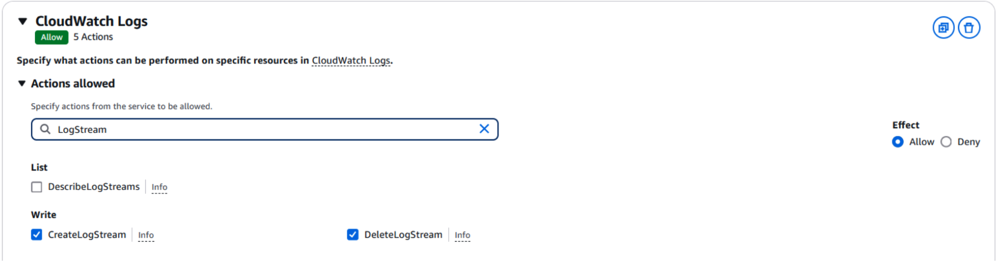

# 🔐 Guide on How to Create Access Key and Secret Access Key

Step-by-step instructions on how to create an **Access Key** and **Secret Access Key** with permissions only to write logs to CloudWatch Logs (create a log group, log stream, send logs—without reading), via the AWS Console:

---

## 🛠️ 1. Create IAM Policy


1. Go to **IAM → Policies → Create policy**

    

2. Choose **CloudWatch Logs** as the service

    

3. Select the following actions:
    - `CreateLogGroup`
    - `CreateLogStream`
    - `PutLogEvents`

**example of how to choose actions:**

     


4. Select the resources the actions should apply to  
   *(e.g., "Any in this account")*

   

5. Click **Next**
6. Name the policy (e.g., `**CloudWatchLogsWriteOnlyPolicy**`)
7. Click **Create policy**

   

---

## 👤 2. Create IAM User

1. Go to **IAM → Users → Create user**

   

2. Name the user (e.g., `cloudwatch-writer`)  
   *(Optional: You can provide AWS Console access)*

   

3. Click **Next**
4. Attach the `CloudWatchLogsWriteOnlyPolicy` to the user

   

5. Click **Next → Create user**

---

## 🔑 3. Create Access Keys

1. Go to **cloudwatch-writer user → Security credentials → Create access key**

   

2. Choose your use case and click **Next → Create access key**

   

3. ⚠️ **Important:** This is the only time the **Secret Access Key** can be viewed or downloaded.  
   If lost, you'll need to generate a new one.

   📥 **Be sure to download the `.csv` file or copy the Access Key and Secret Access Key.**

   

---

## ✅ Summary

- 🛠️ Create IAM Policy
- 👤 Create IAM User
- 🔑 Create Access Keys


## 📁 Store Credentials Securely

**DO NOT** hard-code keys in your source code. Instead:

- Use `BuildConfig` in Android (auto-generated via Gradle)
- Or, store them in a secure secrets manager, encrypted storage, or use environment variables during CI/CD

```java
cloudWatchAppender.setAccessKeyId(BuildConfig.CLOUDWATCH_ACCESS_KEY_ID);
cloudWatchAppender.setSecretAccessKey(BuildConfig.CLOUDWATCH_SECRET_ACCESS_KEY);
```

---

## 🔁 Rotate Keys Regularly

- Delete unused keys
- Rotate credentials periodically to reduce security risks
- Use IAM roles or temporary credentials if deploying in AWS environments (e.g., EC2, Lambda)

---

## 📚 Learn More

- [IAM User Guide – AWS Docs](https://docs.aws.amazon.com/IAM/latest/UserGuide/id_users_create.html)
- [Best Practices for Managing AWS Access Keys](https://docs.aws.amazon.com/general/latest/gr/aws-access-keys-best-practices.html)